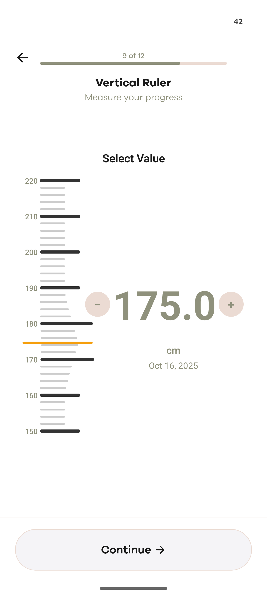

# React Native Vertical Ruler

A highly customizable, smooth vertical ruler component for React Native with magnification effects and precise value selection. Perfect for height measurements, weight selection, or any continuous value input.

## Features

✨ **Smooth Animations** - Uses React Native Reanimated for 60fps animations
🎯 **Precise Gestures** - Accurate touch handling with proper coordinate mapping
🔍 **Magnification Effect** - macOS dock-style scaling of ticks near the cursor
➕ **Increment/Decrement** - Built-in +/- buttons for fine adjustments
🎨 **Fully Customizable** - Colors, sizes, spacing, fonts - all configurable
📱 **Production Ready** - TypeScript support, comprehensive prop validation

## Demo



The component in action showing height measurement selection at 175.0 cm with smooth animations, magnification effects, and interactive +/- controls.

## Installation

```bash
npm install react-native-vertical-ruler react-native-reanimated
```

or with yarn:

```bash
yarn add react-native-vertical-ruler react-native-reanimated
```

## Quick Start

```tsx
import { VerticalRuler } from 'react-native-vertical-ruler';

export default function HeightSelector() {
  return (
    <VerticalRuler
      minValue={150}
      maxValue={220}
      step={1}
      unit="cm"
      title="Select Your Height"
      onValueChange={(value) => console.log('Height:', value)}
    />
  );
}
```

## API Documentation

### Props

#### Value Configuration

| Prop | Type | Default | Description |
|------|------|---------|-------------|
| `minValue` | number | 150 | Minimum value on the ruler |
| `maxValue` | number | 220 | Maximum value on the ruler |
| `step` | number | 1 | Step increment for value changes |
| `unit` | string | 'cm' | Unit label displayed to user |

#### Display Configuration

| Prop | Type | Default | Description |
|------|------|---------|-------------|
| `title` | string | 'Enter Your Height' | Title text shown above ruler |
| `showDate` | boolean | true | Show current date below value |
| `dateFormat` | DateTimeFormatOptions | See default | Intl date format options |
| `enableButtons` | boolean | true | Show +/- increment/decrement buttons |

#### Ruler Configuration

| Prop | Type | Default | Description |
|------|------|---------|-------------|
| `rulerHeight` | number | 400 | Height of the ruler in pixels |
| `rulerWidth` | number | 80 | Width of the ruler in pixels |
| `tickInterval` | number | 5 | Distance between ticks in value units |

#### Magnification Configuration

| Prop | Type | Default | Description |
|------|------|---------|-------------|
| `enableMagnification` | boolean | true | Enable tick magnification effect |
| `magnificationRadius` | number | 80 | Radius in pixels for magnification effect |
| `maxScale` | number | 1.5 | Maximum scale factor for magnified ticks |

#### Styling

All styling is fully customizable:

```tsx
<VerticalRuler
  colors={{
    primary: '#8F917C',
    primaryLight: '#EBDBD3',
    accent: '#D0BEA3',
    warning: '#F59E0B',
    textPrimary: '#1A1A1A',
    textSecondary: '#8F917C',
  }}
  spacing={{
    xs: 4,
    sm: 8,
    md: 16,
    lg: 24,
    xl: 32,
    xxl: 48,
  }}
  fontSize={{
    xs: 12,
    sm: 14,
    md: 16,
    lg: 18,
    xl: 20,
  }}
/>
```

#### Callbacks

| Prop | Type | Description |
|------|------|-------------|
| `onValueChange` | (value: number) => void | Called when value changes via drag or button |

## Advanced Examples

### Custom Styling for Weight

```tsx
<VerticalRuler
  minValue={40}
  maxValue={150}
  step={0.5}
  unit="kg"
  title="What is your weight?"
  colors={{
    primary: '#FF6B6B',
    primaryLight: '#FFE0E0',
    warning: '#FF6B6B',
  }}
  onValueChange={(weight) => {
    updateUserWeight(weight);
  }}
/>
```

### Disabled Magnification

```tsx
<VerticalRuler
  enableMagnification={false}
  // ... other props
/>
```

### Custom Date Format

```tsx
<VerticalRuler
  showDate={true}
  dateFormat={{
    year: 'numeric',
    month: 'long',
    day: 'numeric',
    weekday: 'long',
  }}
  // ... other props
/>
```

### Compact Version

```tsx
<VerticalRuler
  rulerHeight={250}
  rulerWidth={40}
  title="Height"
  spacing={{ xs: 2, sm: 4, md: 8, lg: 12, xl: 16, xxl: 24 }}
  fontSize={{ xs: 10, sm: 12, md: 14, lg: 16, xl: 18 }}
/>
```

### Gesture-Only Mode (Disable Buttons)

```tsx
<VerticalRuler
  enableButtons={false}
  title="Select Your Height"
  // Users can only adjust value via dragging the ruler
/>
```

## TypeScript Support

Full TypeScript support is included:

```tsx
import { VerticalRuler, VerticalRulerConfig } from 'react-native-vertical-ruler';

const config: VerticalRulerConfig = {
  minValue: 150,
  maxValue: 220,
  step: 1,
  onValueChange: (value: number) => console.log(value),
};

<VerticalRuler {...config} />;
```

## Performance

- ✅ Memoized component to prevent unnecessary re-renders
- ✅ Uses React Native Reanimated for smooth 60fps animations
- ✅ Efficient gesture handling with native driver animations
- ✅ Optimized tick rendering and magnification calculations

## Browser Support

- iOS 12+
- Android 8+

## Contributing

Contributions are welcome! Please feel free to submit a Pull Request.

## License

MIT

## Support

For issues and feature requests, please visit the [GitHub repository](https://github.com/yourusername/react-native-vertical-ruler).
